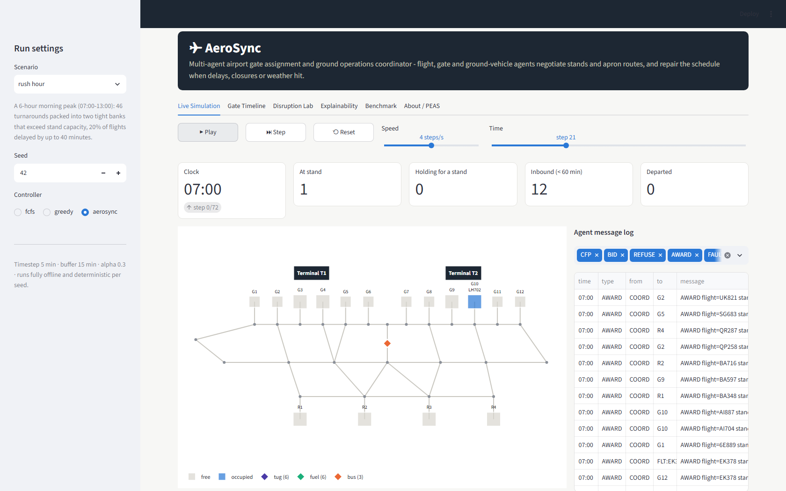
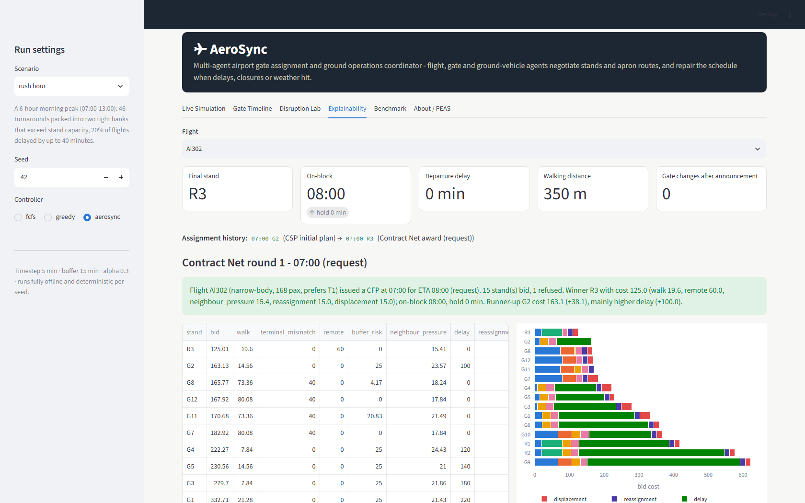
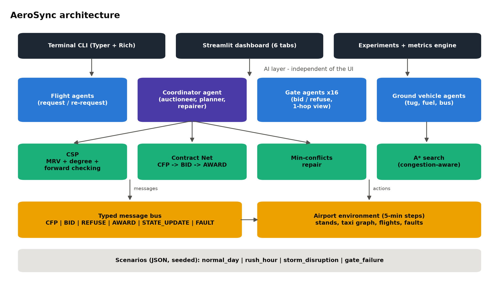
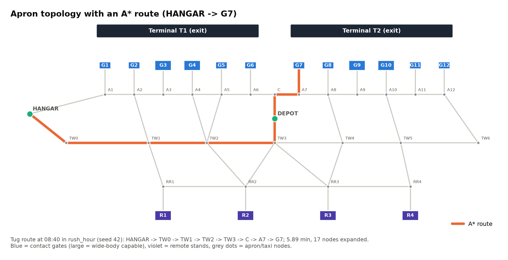
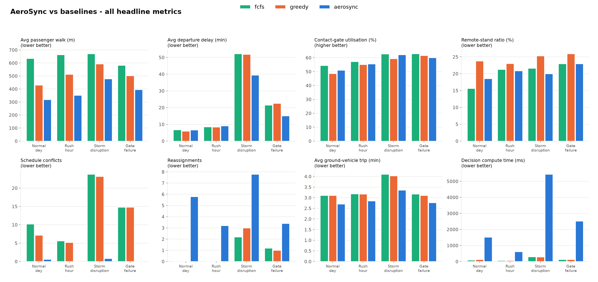

# AeroSync

**Multi-Agent Airport Gate Assignment and Ground Operations Coordinator**

> Autonomous flight, gate and ground-vehicle agents negotiate gate assignments and apron routes in real time, and repair the schedule when delays, gate closures or weather hit.


Case study for the course **Foundations of AI**. The repository contains a working web dashboard, a terminal CLI for live demos, a reproducible experiment pipeline and every asset the presentation needs.

| Live simulation | Explainability |
|---|---|
|  |  |

---

## Contents

- [Problem statement](#problem-statement)
- [Key features](#key-features)
- [AI techniques](#ai-techniques)
- [Architecture](#architecture)
- [PEAS](#peas-gate-agent)
- [Environment characteristics](#environment-characteristics)
- [Project structure](#project-structure)
- [Installation](#installation)
- [Quick start](#quick-start)
- [CLI reference](#cli-reference)
- [Web app guide](#web-app-guide)
- [Scenarios](#scenarios)
- [Experiment results](#experiment-results)
- [Testing](#testing)
- [Design decisions and limitations](#design-decisions-and-limitations)
- [Future work](#future-work)
- [Team and course details](#team-and-course-details)
- [License](#license)

---

## Problem statement

A busy airport must decide, every few minutes, **which stand each arriving aircraft parks at** and **how tugs, fuel trucks and passenger buses reach it**. The decision is hard because:

- capacity is tight: 12 contact gates and 4 remote stands, and only 8 of those 16 can take wide-body aircraft;
- hard rules must never break: one aircraft per stand, a 15-minute separation buffer, wide-bodies only at wide-capable stands, no parking at a closed stand;
- the airport has competing soft goals: short passenger walks, few remote-stand (bus) operations, aircraft parked at their own terminal, few gate changes after the gate is announced, and little delay pushed onto departures;
- the world keeps changing: arrival delays become known only 20-60 minutes in advance, gates fail, vehicles break down, comms drop and storms slow the apron.

A central "perfect knowledge" optimiser is unrealistic. AeroSync models the problem as a **cooperative multi-agent system**. Each gate decides for itself whether it can host a flight and at what cost, negotiates through an explicit protocol, and the schedule is repaired locally when something breaks.

## Key features

- **Four agent types** on a typed message bus (`CFP`, `BID`, `REFUSE`, `AWARD`, `STATE_UPDATE`, `FAULT`), each with a full, inspectable message log.
- **CSP initial schedule** using backtracking with MRV, the degree heuristic and forward checking.
- **Contract Net Protocol** for gate negotiation, with a documented bid formula. Each bid is broken down per cost term and explained in plain English.
- **Min-conflicts repair** after disruptions, with a random-walk escape and a CSP re-plan fallback.
- **Congestion-aware A\*** routing for tugs, fuel trucks and buses on a 42-node apron graph, with an admissible heuristic. Vehicles replan around blocked edges.
- **Fault injection**: gate closure, flight delay, ground-vehicle breakdown, communication loss and weather.
- **Fair benchmarking** against `fcfs` and `greedy` baselines on identical seeded scenarios. All numbers come from real runs.
- **Terminal CLI** (Typer + Rich) with live animation, an ASCII Gantt chart, explanations and route breakdowns. **Streamlit dashboard** with 6 tabs.
- Deterministic (`--seed`), fully offline, with no API keys. A 72-step rush-hour run finishes in under a second.

## AI techniques

### 1. Constraint Satisfaction Problem: initial schedule

- **Variables:** flights.
- **Domain:** `(stand, hold)` with `hold ∈ {0, 5, …, 120}` min.
- **Constraints:** same stand ⇒ `start_b ≥ end_a + 15`; wide-body ⇒ wide-capable stand; closed stand ⇒ unavailable.

```
BACKTRACK(assignment):
    if complete: return assignment
    v ← argmin_{unassigned} |D(v)|                 # MRV
          tie-break: max #constraints on unassigned # degree heuristic
    for x in D(v) ordered by soft cost:             # least-cost value first
        prune clashing values from neighbours' D    # forward checking
        if no domain is empty and BACKTRACK(assignment ∪ {v=x}) succeeds: return it
        restore pruned values
    return failure
```

The CSP solves every scenario without backtracking (for example 46 nodes and 7 824 values pruned on `rush_hour`). The worked example is in `docs/slide_assets/diagrams/csp_worked_example.png`.

### 2. Contract Net Protocol: negotiation

One hour before its ETA (or immediately after a disruption), a flight agent triggers a **CFP**. Each of the 16 gate agents replies with a **BID** or a **REFUSE**. The coordinator **AWARDs** the minimum-cost bid, breaking ties by stand id.

```
bid = w1·walk_m·(pax/150) + w2·terminal_mismatch + w3·remote + w4·buffer_risk
    + w5·(α · neighbour_load) + w6·hold_min + w7·(reassignment + displaced)
```

| Weight | w1 walk | w2 mismatch | w3 remote | w4 buffer risk | w5 neighbour | w6 hold | w7 reassign / displace | α |
|---|---|---|---|---|---|---|---|---|
| Value | 0.05 /m | 40 | 60 | 25 | 100 | 4 /min | 15 | **0.30** |

- `neighbour_load` is the mean share of `[start-60, end+60]` occupied at the **1-hop neighbour stands**. A gate knows this only through their `STATE_UPDATE` messages, so it is partially observable and can go stale during a comms loss.
- `buffer_risk = max(0, (30 - slack)/30)` grows as the gap to adjacent slots shrinks.
- **Firm vs provisional contracts.** Only *announced* contracts and aircraft on block make a slot infeasible. A bid may displace a *provisional* CSP slot by paying `w7` per displaced flight. Displaced flights are then re-homed by min-conflicts.

### 3. Min-conflicts: schedule repair

```
repeat up to 2000 steps (stop after 150 without improvement):
    C ← movable flights in conflict          # provisional first, announced last
    v ← random(C)
    x ← argmin_{x ∈ D(v)} (#conflicts(v,x), soft_cost(v,x) + move penalty)
    with probability 0.2, if v cannot be made conflict-free: x ← random value (random walk)
if conflicts remain: re-solve the movable flights as a CSP (fixed = everything else)
```

Announced flights pay three times the reassignment penalty and are picked only when no provisional flight is in conflict, so passengers see as few gate changes as possible.

### 4. A\* search: ground-vehicle routing

- Edge cost (min) = `length / speed × congestion(edge, t)`, where `congestion = weather × (1 + 0.30 × aircraft movements within ±10 min at an adjacent stand)`.
- Blocked edges (for example a broken-down vehicle) are removed.
- Heuristic: `h(n) = euclid(n, goal) / speed`. It is **admissible** because every edge is a straight segment and `congestion ≥ 1`.
- The tests check A\* against Dijkstra on 125 random-graph queries and check admissibility exhaustively on the apron graph.
- The baselines use the static shortest-distance path and wait at blocked edges.

## Architecture



The AI layer (`aerosync/agents`, `aerosync/ai`) knows nothing about the UI. The CLI, the dashboard and the experiment runner all drive the same `Simulation` through a small controller interface (`aerosync/controllers.py`).

| Agent | Objective | Sees | Acts |
|---|---|---|---|
| **Flight** | own delay + passenger walk | its own ETA (revealed late) | CFP request / re-request, `STATE_UPDATE` |
| **Gate** (×16) | low bid cost, safe buffers | own schedule + 1-hop neighbours via messages | `BID`, `REFUSE`, `STATE_UPDATE` |
| **Ground vehicle** (tug, fuel, bus) | earliest arrival | apron graph, live congestion, blocked edges | A\* route, replan |
| **Coordinator** | airport-wide cost | protocol messages only | CSP plan, `AWARD`, min-conflicts repair, decision log |



## PEAS: Gate Agent

| | Gate Agent |
|---|---|
| **Performance** | Low passenger walking, few remote / terminal-mismatch parkings, zero buffer violations, low hold delay, few gate changes, balanced load with neighbouring stands |
| **Environment** | Its own stand schedule, the 1-hop neighbouring stands (via `STATE_UPDATE` only), closures, CFPs from the coordinator, a dynamic apron with delays and faults |
| **Actuators** | `BID` / `REFUSE` replies, `STATE_UPDATE` broadcasts, accepting `AWARD`s (commitments) |
| **Sensors** | `CFP`, `AWARD`, `FAULT` and neighbour `STATE_UPDATE` messages |

## Environment characteristics

| Property | Why |
|---|---|
| **Partially observable** | Arrival delays are hidden until revealed 20-60 min ahead. Gate agents see only their own and their neighbours' schedules. |
| **Stochastic** | Seeded random delays, plus closures, breakdowns and comms loss. |
| **Sequential** | Every award constrains later flights at that stand and its neighbours. |
| **Dynamic** | The world advances every 5 minutes while the agents deliberate. |
| **Multi-agent** | Flight, gate (×16), ground-vehicle and coordinator agents. |
| **Cooperative** | All agents minimise one shared airport-wide cost. |

## Project structure

```
aerosync/
├── aerosync/
│   ├── agents/        flight_agent.py, gate_agent.py, vehicle_agent.py, coordinator.py
│   ├── ai/            csp.py, min_conflicts.py, contract_net.py, astar.py, model.py
│   ├── sim/           airport.py, flights.py, scenarios.py, events.py,
│   │                  message_bus.py, environment.py
│   ├── metrics/       engine.py
│   ├── cli/           main.py               (Typer + Rich CLI)
│   ├── webapp/        app.py                (Streamlit dashboard)
│   ├── viz/           charts.py, terminal.py
│   ├── controllers.py fcfs | greedy | aerosync
│   ├── experiments.py single runs, comparisons, batch reports
│   └── config.py      every parameter (weights, alpha, buffer, timestep, ...)
├── scenarios/         normal_day.json, rush_hour.json, storm_disruption.json, gate_failure.json
├── tests/             pytest suite (72 tests)
├── results/           summary.json/.csv, runs.csv, runs/*.json, charts/*.png
├── docs/slide_assets/ metrics, charts, diagrams, screenshots, facts.md
├── scripts/           make_slide_assets.py, capture_dashboard.py
├── demo.sh            scripted 3-minute terminal demo
├── Makefile           install | demo | test | report | serve
└── pyproject.toml     package + `aerosync` console script
```

## Installation

You need Python **3.11 or newer**. Everything runs offline once the dependencies are installed.

**macOS / Linux**

```bash
git clone https://github.com/joshuakarthik2005/AeroSync.git
cd AeroSync
python3 -m venv .venv
source .venv/bin/activate
pip install -e ".[dev]"
python -m playwright install chromium   # only needed to regenerate screenshots
```

**Windows (PowerShell)**

```powershell
git clone https://github.com/joshuakarthik2005/AeroSync.git
cd AeroSync
py -3.12 -m venv .venv
.venv\Scripts\Activate.ps1
pip install -e ".[dev]"
python -m playwright install chromium
```

`pip install -r requirements.txt` also works. With `make` available, `make install` does all of the above.

## Quick start

```bash
aerosync scenarios                                   # what can I run?
aerosync simulate --scenario rush_hour --live        # watch the agents work
aerosync compare --scenario storm_disruption         # fcfs vs greedy vs aerosync
aerosync serve                                       # dashboard on http://localhost:8501
bash demo.sh                                         # the full 3-minute demo
```

Every command also works as `python -m aerosync …`.

## CLI reference

| Command | What it does |
|---|---|
| `aerosync scenarios` | Lists scenarios with window, flights and scripted faults |
| `aerosync simulate --scenario rush_hour --controller aerosync --seed 42 [--steps 72] [--live] [--save DIR]` | Runs one scenario and prints a run summary and the metrics. `--live` animates the stands and the message log |
| `aerosync compare --scenario storm_disruption --seed 42 [--out results/]` | Runs all 3 controllers on the same seed, prints the metric table and saves a chart plus per-run JSON/CSV |
| `aerosync disrupt --scenario normal_day --event gate_closure --gate G4 --at 30` | Injects a fault (`gate_closure`, `flight_delay --flight X --minutes N`, `vehicle_breakdown --vehicle FUEL1`, `comms_loss`, `weather`). Shows the repair, before/after Gantt charts and the impact |
| `aerosync explain --flight AI302 [--scenario rush_hour]` | Shows every Contract Net round for one flight: bids, per-term breakdown, refusals, winner and reasoning |
| `aerosync route --from HANGAR --to G7 --seed 42 [--kind tug] [--at 24]` | Plans an A\* path on the live apron graph. Shows the per-edge cost breakdown, nodes expanded vs Dijkstra, and the baseline static path |
| `aerosync gantt --scenario rush_hour --controller aerosync` | Gate-occupancy timeline in the terminal |
| `aerosync report --scenario all --out results/ [--seeds 42,43,44,45,46]` | Full batch experiment: writes CSV/JSON and charts |
| `aerosync serve [--port 8501] [--headless]` | Launches the Streamlit dashboard |

**Example: `aerosync simulate --scenario rush_hour --controller aerosync --seed 42`** (real output)

```
│ rush_hour under aerosync (seed 42)
│ Window 07:00-13:00, 46 flights, 46 departed by 13:00
│ Messages: CFP 848, BID 720, REFUSE 128, AWARD 155, STATE_UPDATE 384, FAULT 0
│ Auctions 53, repairs 21, vehicle dispatches 102, towing 0, hard violations 0
│ CSP: CSP assigned 46/46 flights with 46 nodes, 0 backtracks and 7824 values pruned by forward checking.
┌───────────────────────────────┬──────────┐
│ Metric                        │ aerosync │
├───────────────────────────────┼──────────┤
│ Avg passenger walk (m)        │    362.0 │
│ Avg departure delay (min)     │     12.5 │
│ Contact-gate utilisation (%)  │     53.5 │
│ Remote-stand ratio (%)        │     21.7 │
│ Schedule conflicts            │        0 │
│ Reassignments                 │        5 │
│ Avg ground-vehicle trip (min) │      2.8 │
│ Decision compute time (ms)    │    886.6 │
└───────────────────────────────┴──────────┘
```

**Example: `aerosync route --from HANGAR --to G7 --seed 42`** (traffic of `rush_hour` at 08:40)

```
Path: HANGAR -> TW0 -> TW1 -> TW2 -> TW3 -> C -> A7 -> G7
A* cost 5.89 min over 1472 m, nodes expanded 17
Dijkstra (h=0) cost 5.89 min, nodes expanded 27 (same optimum: True)
Static shortest-distance path (baselines): HANGAR -> A1 -> A2 -> A3 -> A4 -> A5 -> A6 -> C -> A7 -> G7 = 6.62 min under the same conditions
Heuristic h(n) = euclid(n, G7) / 250 m/min (admissible: congestion >= 1)
```

The A\* tug avoids the congested T1 apron road. Its route is 232 m longer but 11% faster, and A\* expands 17 nodes where Dijkstra expands 27 to find the same optimum. Full captures of every command are in [`docs/slide_assets/screenshots/`](docs/slide_assets/screenshots/) (`terminal_*.txt` and `terminal_*.png`). The full `explain` output is in [`docs/slide_assets/explain_example.txt`](docs/slide_assets/explain_example.txt).

## Web app guide

Start the dashboard with `aerosync serve`. The sidebar picks the scenario, the seed and the controller. Every run is cached, so switching between them is instant.

| Tab | What you can do |
|---|---|
| **Live Simulation** | Play / pause / step / reset and a speed control. Shows an animated apron map (stands coloured by status, vehicles moving along their A\* paths, closures), KPIs and a filterable agent message log |
| **Gate Timeline** | Plotly Gantt chart of the actual stand occupancy. Conflicts are in red and closures are hatched. Toggle the controller |
| **Disruption Lab** | Inject a gate closure, flight delay, vehicle breakdown or comms failure at a chosen step. Shows the before/after Gantt charts, the repaired flights, the agents involved, the metric deltas and all controllers under the same fault |
| **Explainability** | Pick any flight to see its assignment history, every Contract Net round, a bid table, a stacked cost-breakdown chart and the reasoning |
| **Benchmark** | fcfs vs greedy vs aerosync from `results/summary.json`, with a "Run benchmark now" button |
| **About / PEAS** | PEAS table, environment-characteristics cards, architecture diagram and parameters |

Screenshots of all 6 tabs are in [`docs/slide_assets/screenshots/`](docs/slide_assets/screenshots/).

## Scenarios

| Scenario | Window | Flights | Stochastic delays | Scripted faults |
|---|---|---|---|---|
| `normal_day` | 06:00-22:00 (192 steps) | 110 | 15% delayed, 5-30 min | none |
| `rush_hour` | 07:00-13:00 (72 steps) | 46 in two banks that exceed stand capacity | 20% delayed, 5-40 min | none |
| `storm_disruption` | 12:00-20:00 (96 steps) | 72 | 45% delayed, 10-90 min | weather ×1.4 for 4 h, G2 closed 2 h, wide-body G9 closed 3 h, FUEL2 breakdown |
| `gate_failure` | 09:00-15:00 (72 steps) | 54 | 15% delayed, 5-30 min | wide-body gate G4 closes at 11:00 for the rest of the day |

The scenarios are JSON files in `scenarios/` that define generator parameters, the fleet and events. The flight list is generated deterministically from `--seed`. Each scenario also contains the featured flight **AI302** for the `explain` demo.

## Experiment results

All numbers below come from real runs stored in `results/` and are reproduced by:

```bash
aerosync report --scenario all --out results/ --seeds 42,43,44,45,46
```

Each value is the mean over 5 seeds (standard deviations are in `results/summary.csv`). **Bold** marks the best value per scenario.

| Scenario | Controller | Walk (m) | Dep. delay (min) | Gate util. (%) | Remote (%) | Conflicts | Reassign. | Vehicle trip (min) | Compute (ms) |
|---|---|---:|---:|---:|---:|---:|---:|---:|---:|
| normal_day | fcfs | 634.6 | 6.7 | **54.4** | **15.7** | 10.2 | **0.0** | 3.1 | **88.0** |
| normal_day | greedy | 429.7 | **6.0** | 48.7 | 23.8 | 7.2 | **0.0** | 3.1 | 133.2 |
| normal_day | **aerosync** | **318.8** | 6.7 | 51.0 | 18.6 | **0.6** | 5.8 | **2.7** | 1,521.7 |
| rush_hour | fcfs | 663.3 | 8.6 | **57.2** | 21.3 | 5.6 | **0.0** | 3.2 | **68.5** |
| rush_hour | greedy | 512.7 | **8.4** | 55.2 | 23.0 | 5.2 | **0.0** | 3.2 | 69.3 |
| rush_hour | **aerosync** | **352.2** | 9.1 | 55.6 | **20.9** | **0.0** | 3.2 | **2.9** | 615.2 |
| storm_disruption | fcfs | 671.3 | 52.2 | **62.8** | 21.6 | 23.8 | **2.2** | 4.1 | 293.4 |
| storm_disruption | greedy | 593.4 | 51.9 | 59.3 | 25.3 | 23.2 | 3.0 | 4.0 | **283.4** |
| storm_disruption | **aerosync** | **479.2** | **39.4** | 62.2 | **20.0** | **0.8** | 7.8 | **3.4** | 5,447.4 |
| gate_failure | fcfs | 582.2 | 21.5 | **62.9** | **23.0** | 14.8 | 1.2 | 3.2 | **123.6** |
| gate_failure | greedy | 502.6 | 22.6 | 61.6 | 25.9 | 14.8 | **1.0** | 3.1 | 128.8 |
| gate_failure | **aerosync** | **395.1** | **15.1** | 60.1 | **23.0** | **0.2** | 3.4 | **2.8** | 2,516.3 |



**Findings**

- **Walking:** AeroSync has the shortest passenger walk in every scenario, 19-31% below greedy and 29-50% below fcfs.
- **Disruption resilience:** under the storm, departure delay falls from 51.9 min (greedy) to **39.4 min** (-24%). Under the gate failure it falls from 22.6 min to **15.1 min** (-33%).
- **Conflicts:** an aircraft arriving to find its planned stand occupied or closed almost never happens with AeroSync (≤ 0.8 per run, against 5-24 for the baselines), because min-conflicts repairs the plan before the aircraft arrives.
- **Ground vehicles:** congestion-aware A\* with best-arrival dispatch cuts the average trip by 10-17%.
- **Trade-offs:**
  - In calm scenarios, departure delay is on par with greedy or slightly higher (rush hour: 9.1 vs 8.4 min), because AeroSync trades a few minutes of hold for much shorter walks.
  - AeroSync changes more announced gates (3-8 per run, against 0-3).
  - It needs 0.6-5.4 s of compute per simulated day, against 0.07-0.3 s for the baselines. That is still far below real time.

Per-metric charts are in `results/charts/bars_*.png`. Before/after disruption Gantt charts are in `docs/slide_assets/charts/`.

## Testing

```bash
pytest          # 72 tests, about 20-30 s
ruff check .    # lint
```

| Test file | Covers |
|---|---|
| `test_csp.py` | CSP never violates hard constraints (all scenarios, several seeds, with closures); MRV, the degree heuristic and forward checking behave as specified; an over-constrained problem is reported as failed |
| `test_min_conflicts.py` | A gate closure is repaired with **zero** conflicts; repair is a no-op on a valid plan; the simulator never parks at a closed gate |
| `test_astar.py` | A\* cost equals Dijkstra's on 125 random-graph queries; the heuristic is admissible (random graphs and the apron graph); blocked edges are avoided |
| `test_contract_net.py` | The minimum-cost feasible bid wins; refusals never win; ties break by id; comms loss counts as a refusal; the bid formula, firm vs provisional slots and the neighbour-only view |
| `test_reproducibility.py` | Same seed ⇒ identical flights, metrics and message log; different seeds ⇒ different schedules |
| `test_metrics.py` | A hand-built 3-flight scenario whose walking distance (800.0 m), utilisation and delays are worked out by hand; all controllers respect hard constraints in every scenario |

## Design decisions and limitations

- **Firm vs provisional contracts.** Without this split, the CSP's day-ahead plan blocked better options for flights arriving soon and AeroSync ended up with *higher* delays than greedy. Treating un-announced slots as displaceable fixed that. It is the single most important design choice.
- **The definition of reassignment is the same for all controllers.** It counts a stand change after the gate was announced (T-60). An ETA slip beyond the look-ahead withdraws the announcement.
- **Baselines are deliberately simple**, as the brief requires: no negotiation, no repair, static routing. They still respect every hard constraint (verified by the tests).
- **Simplified physics.** Aircraft taxiing is not modelled; a hold means waiting for the stand. Turnaround services are fuel, a bus for remote stands, and a tug for pushback. Congestion is a multiplier, not a queue.
- **The weights are hand-tuned**, not learned, and the results depend on them (`config.py`, `facts.md`).
- **Compute time** is wall-clock time and depends on the machine. It is the only metric that is not bit-reproducible.
- The coordinator still serialises the auctions. A truly distributed implementation would run the gate agents concurrently.

## Future work

- Learn the bid weights (for example with Bayesian optimisation over the seeded scenarios) or learn a stand-preference model from historic data.
- Model aircraft taxi conflicts on runways and taxiways, plus multi-vehicle path coordination (conflict-based search).
- Use stochastic ETAs (distributions instead of point estimates) and robust or chance-constrained planning.
- Run the agents as asynchronous processes with real message latency and loss.
- Add connecting-passenger transfer times between gates (the gate-to-gate walking matrix already exists in `airport.py`).

## Team and course details

| | |
|---|---|
| Course | Foundations of AI |
| Project | AeroSync: Multi-Agent Airport Gate Assignment and Ground Operations Coordinator |
| Team member 1 | A Joshua Karthik - CB.SC.U4CSE23501 |
| Team member 2 | Akash B - CB.SC.U4CSE23502 |
| Team member 3 | Midhunan Vijendra Prabhaharan - CB.SC.U4CSE23532 |
| Team member 3 | Varun Hirthik - CB.SC.U4CSE23567 |
| Team member 3 | Barath Arjun - CB.SC.U4CSE23569 |
| Instructor | Sruthi Mam |
| Institution | Amrita Vishwa Vidyapeetham |

## License

[MIT](LICENSE)
